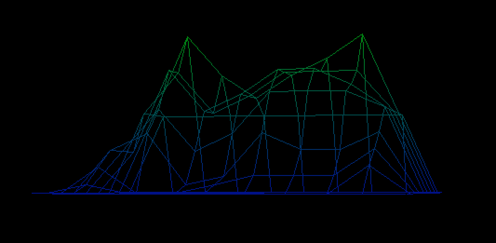
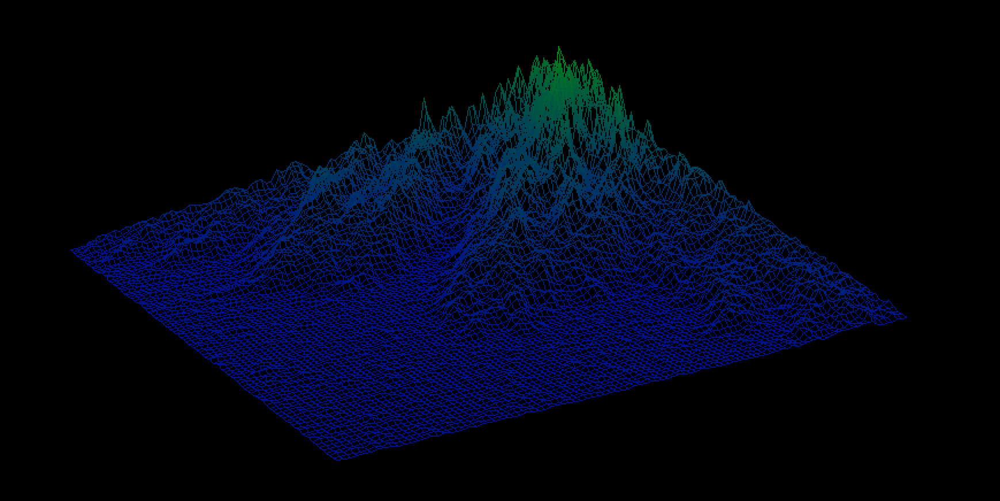
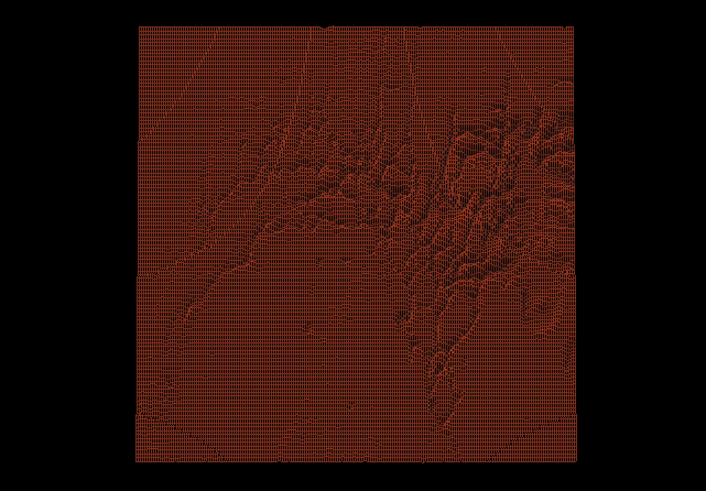

# fdf

This program takes in files of a particular format (essentially a matrix of evenly spaced heights) and translates them into a rotatable wireframe model, with an even color gradient from minimum to maximum height. Several different options are exhibited below - the C1 and C2 macros represent minimum height color and maximum height color respectively in 0RGB format.

## Controls

* Arrow keys for rotation
* Click and drag to move the wireframe in space
* Ctrl + click and drag to zoom in and out
* Command + click and drag to change the height scaling

